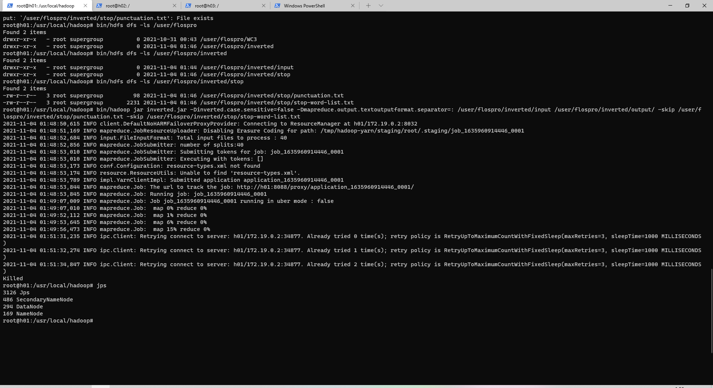

### 跑样例代码调整好环境

​	首先调试环境，发现idea无法初始化集群，查阅资料[(21条消息) Hadoop 解决本地运行出错Cannot initialize Cluster. Please check your configuration for mapreduce.framework..._Pineapple的博客-CSDN博客](https://blog.csdn.net/pineapple_C/article/details/108964998)发现，hadoop-mapreduce-client-core.jar是支持放在集群上运行的，hadoop-mapreduce-client-common.jar是支持在本地运行的，应该加上需要的依赖，补充maven配置文件。配置好后正常运行。参考代码：[Hadoop MapReduce: 带词频属性的文档倒排索引 - Penguin (polarxiong.com)](https://www.polarxiong.com/archives/Hadoop-MapReduce-带词频属性的文档倒排索引.html)

### 代码正文介绍

​	运行命令

`bin/hadoop jar inverted.jar -Dinverted.case.sensitive=false -Dmapreduce.output.textoutputformat.separator=: input/ output/ -skip punctuation.txt -skip stop-word-list.txt`

​	这次有经验，对代码构架更熟悉，写的代码更加简洁干净，文件参数均为实际路径。

​	具体实现：

**mapper**：对输入的Text切分为多个word,每个word作为一个key输出

- 输入：key:当前行偏移位置, value:当前行内容；

- 输出：key:word#filename, value:1

**combiner**：将Mapper输出的中间结果相同key部分的value累加，减少向Reduce节点传输的数据量

- 输出：key:word#filename, value:累加和

**partitioner**：为了将同一个word的键值对发送到同一个Reduce节点，对key进行临时处理，将原key的(word, filename)临时拆开，使Partitioner只按照word值进行选择Reduce节点
**reduce**：利用每个Reducer接收到的键值对中，是按照同一个word排好序一起出现的，将相同的word对应的(word,filename)拆分开，将filename与累加和构成键值对存储到临时Hashmap中。当累加出现到word不同时，将前面的结果利用MiscUtils排好序再写入临时StringBuilder中来写入文件即完成了旧word的统计，则将新word作为key再次开始。

- 输入：key:word#filename, value:[NUM,NUM,...] 

- 输出：key:word, value:filename#NUM,filename#NUM,...

**cleanup**：  上述reduce()只会在遇到新word时，处理并输出前一个word，故最后一个word还需要额外的处理。重载cleanup()，处理最后一个word并输出。

​		正确运行。

### 在docker集群中运行

​		迁移好文件后，执行命令：

​		运行到15%之前一切正常，但是由于电脑承受不住运载，服务宕机了，任务被kill。从报错：连不上服务器和jps可以看出，确实是性能问题。

​				再次尝试：

​		虽然在单机上表现优秀，集群还是宕机，个人使用的电脑是小新air14 2019。本来是最近的作业跑不动时就有考虑申请bdkit，但一方面考虑到最近的wordcount3.0中我不恰当地同时创建了多个MR任务，是没有认真把控开销导致的宕机，正常操作可能能运行有侥幸心理，一方面老师说到最近南大的bdkit需要维护只能后续申请阿里云的需要注意作业完成时间就没有去申请，这次一定得找助教申请bdkit了。
